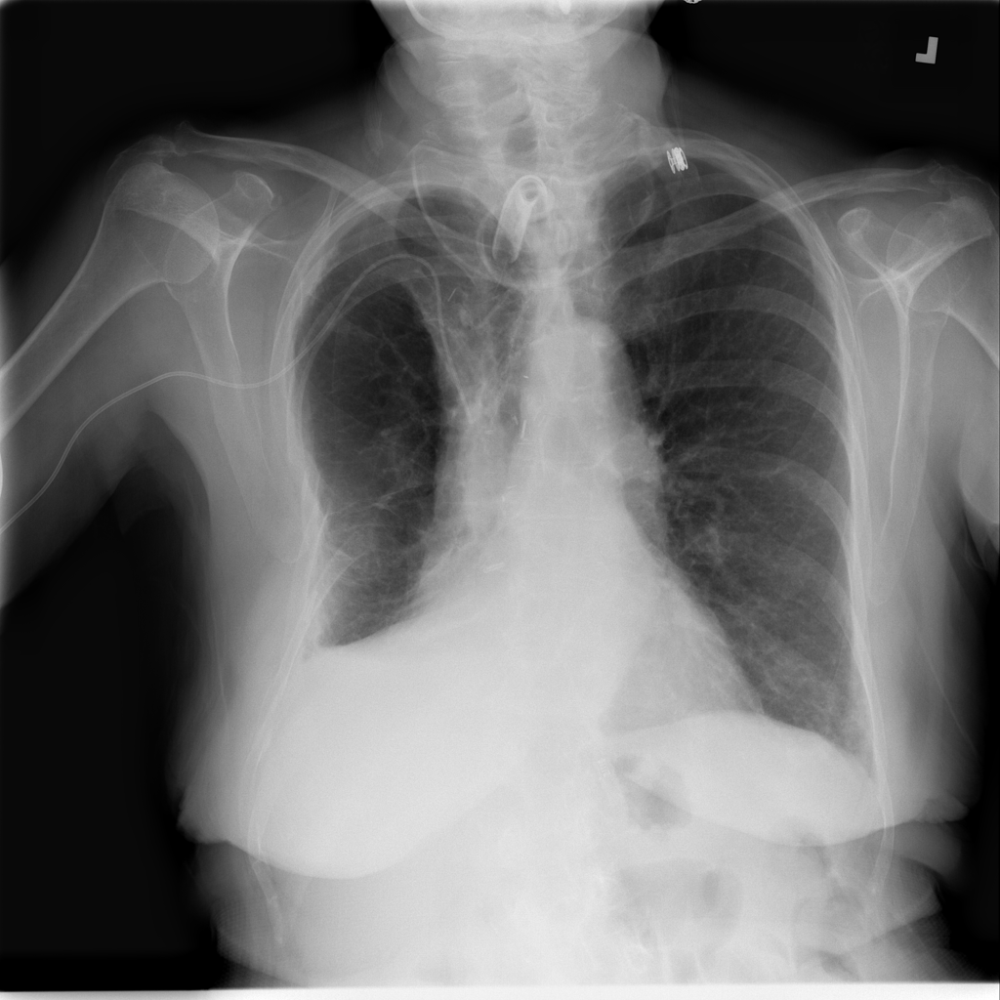

# Multi-Disease Detection and Classification in Chest Radiography: A Deep Convolutional Neural Network Approach  

### Author:  
**Paul O. Okafor (MS)**  

---

## Project Overview  
This project leverages **deep learning** to enhance the detection and classification of thoracic diseases through **YOLOv8** models, utilizing the **NIH Chest X-ray Dataset** containing 112,120 X-ray images. The aim is to automate medical diagnostics and improve **accuracy** in detecting 14 distinct diseases.   


---

## Key Features  
- **Dataset**: NIH Chest X-ray Dataset with 30,805 patients, labeled for 14 pathologies.  
- **Models**: YOLOv8 detection model (8 diseases) & classification model (14 diseases).  
- **Training**: Focused on minimizing loss over 100 epochs with top-1 and top-5 accuracy metrics.  
- **Evaluation**: Metrics include **precision-recall curves**, **F1 scores**, and **loss graphs** to track progress and challenges in learning.  
- **Objective**: Aid radiologists with real-time, automated diagnostics.  

---
## Setup  
1. **Clone Repository**  
   ```bash
   git clone <repo_url>
   cd multi-disease-detection-chest-xray
